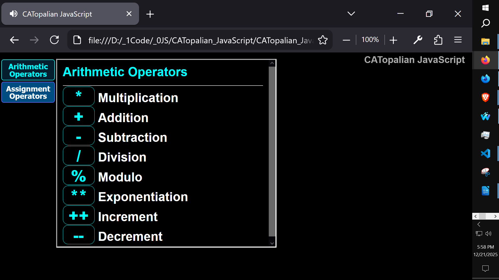
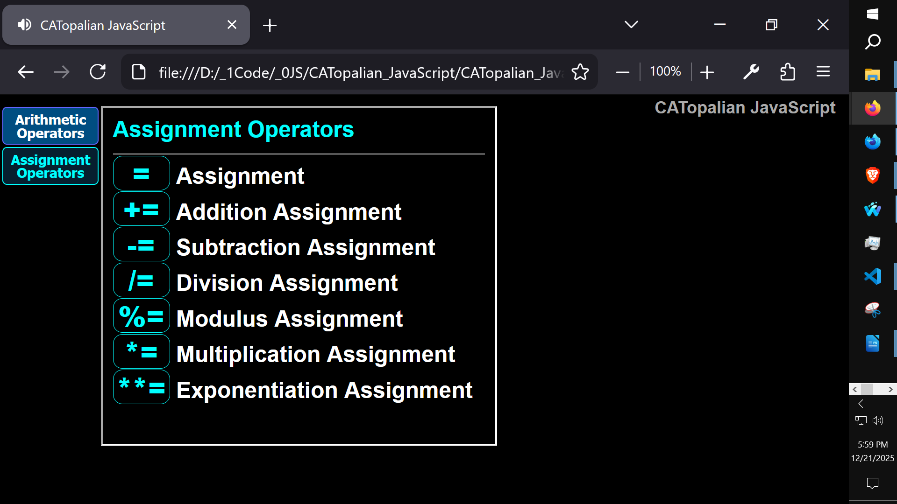

# CATopalian JavaScript
A JavaScript app designed for teaching JavaScript and anything else.

---

Video: https://www.youtube.com/watch?v=Uo_JDMm4sH0

Use App: https://christopherandrewtopalian.github.io/CATopalian_JavaScript/CATopalian_JavaScript.html

---

### How to Download this App
1. Click the green Code Button on this github page
2. Choose Download ZIP
3. Save the Zip File
4. Extract All
5. Double click the HTML file to start the App

---

Happy Scripting :-)

//----//

// Dedicated to God the Father  
// All Rights Reserved Christopher Andrew Topalian Copyright 2000-2025  
// https://github.com/ChristopherTopalian  
// https://github.com/ChristopherAndrewTopalian  
// https://sites.google.com/view/CollegeOfScripting  
College of Scripting Music & Science

